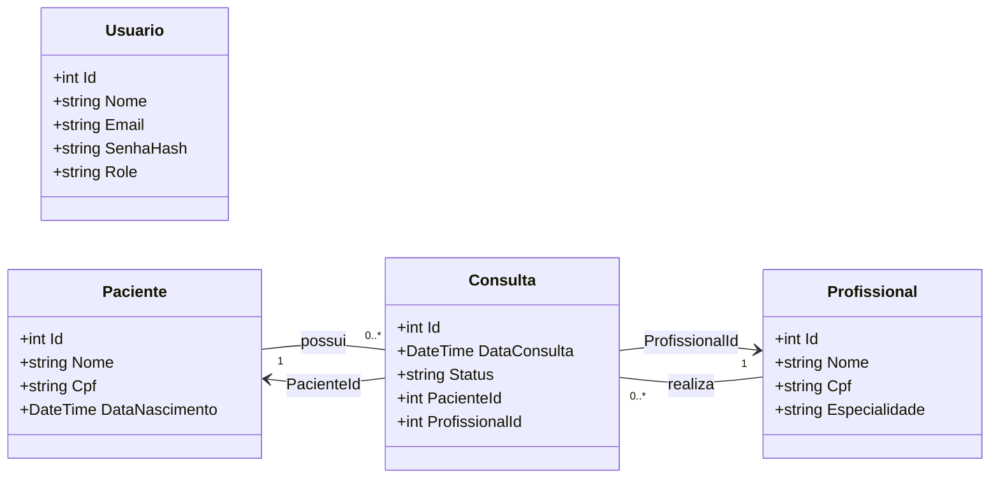
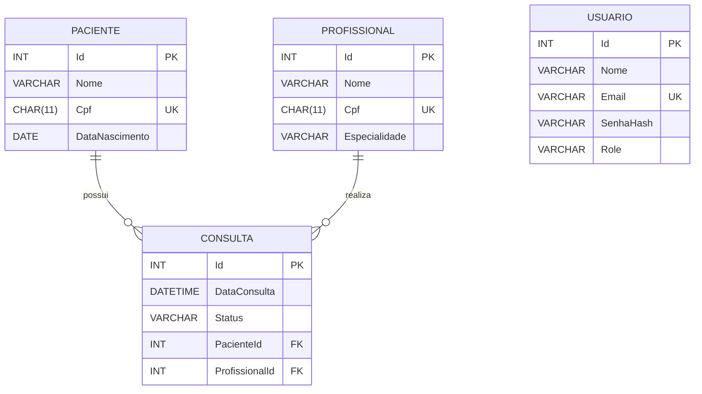

# 📊 Modelagem do Sistema SGHSS

Este documento apresenta a **modelagem conceitual e lógica** do sistema **SGHSS (Sistema de Gestão Hospitalar e de Serviços de Saúde)**, atendendo ao ponto 4 do projeto.  
Foram construídos dois diagramas principais:
1. **Diagrama de Classes (UML)** → visão orientada a objetos.
2. **Diagrama Entidade-Relacionamento (DER)** → visão do banco de dados relacional.

---

## 📐 Diagrama de Classes (UML)

O diagrama de classes descreve a estrutura das entidades de domínio da aplicação, bem como seus atributos e relacionamentos.

📌 **Observações sobre as entidades:**
- `Usuario`: controla autenticação e autorização (roles: Admin, Profissional, Paciente).
- `Paciente`: armazena dados pessoais e suas consultas.
- `Profissional`: registra dados do médico/profissional de saúde e as consultas realizadas.
- `Consulta`: associa paciente e profissional, com data e status (Agendada, Cancelada, Realizada).

---

## 🗄️ Diagrama Entidade-Relacionamento (DER)

O DER representa a modelagem lógica do banco de dados relacional que dará suporte ao sistema.

📌 **Observações sobre as tabelas e constraints:**
- `USUARIO.Email` e `PACIENTE.Cpf` / `PROFISSIONAL.Cpf` são **únicos** (constraints `UK`).
- `CONSULTA.PacienteId` → `PACIENTE.Id` (**FK**)
- `CONSULTA.ProfissionalId` → `PROFISSIONAL.Id` (**FK**)
- Relacionamento **1:N**: um paciente pode ter várias consultas.
- Relacionamento **1:N**: um profissional pode realizar várias consultas.

---

## ✅ Conclusão

A modelagem define claramente:
- A **estrutura orientada a objetos** (UML).
- O **modelo lógico relacional** (DER).
- Regras de unicidade (CPF, Email) e integridade referencial (FKs).

Com esses diagramas, garantimos que o sistema SGHSS possui uma base sólida de dados e entidades para evoluir nas próximas etapas do projeto.
